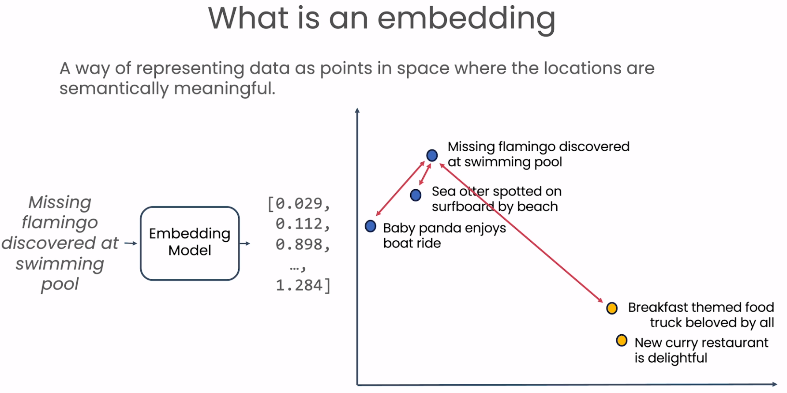
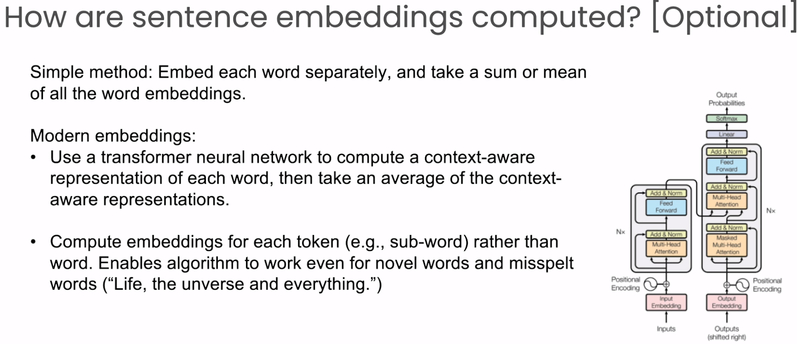

# 🚀 [Understanding and Applying Text Embeddings](https://www.deeplearning.ai/short-courses/google-cloud-vertex-ai/)

💻 Welcome to the "Understanding and Applying Text Embeddings" course! This course, instructed by Nikita Namjoshi, Developer Advocate for Generative AI at Google Cloud, and Andrew Ng, Founder of DeepLearning.AI, will guide you through the process of utilizing text embeddings to enhance various natural language processing tasks.

**Course Website**: 📚[deeplearning.ai](https://www.deeplearning.ai/short-courses/google-cloud-vertex-ai/)

## Course Summary
In this course, you will explore the capabilities of the Vertex AI Text-Embeddings API and learn how to leverage text embeddings for various NLP tasks. Here's what you can expect to learn and experience:

1. 📚 **Properties of Text Embeddings**: Understand the characteristics of word and sentence embeddings.

 
 

2. 🔄 **Semantic Similarity Measurement**: Learn how embeddings can be used to measure the semantic similarity between two pieces of text.

  

3. 🛠 **Application of Text Embeddings**: Apply text embeddings for tasks such as classification, clustering, and outlier detection.

  

4. 🎛 **Adjusting LLM Parameters**: Modify the text generation behavior of an LLM by adjusting parameters like temperature, top-k, and top-p.

  
  
  

5. 🚀 **Efficient Semantic Search**: Use the open-source ScaNN (Scalable Nearest Neighbors) library for efficient semantic search.
6. ❓ **Building a Q&A System**: Combine semantic search with an LLM to build a question-answering system using Google Cloud's Vertex AI.

  
  
  
  

## Key Points
- 🔑 Use text embeddings to capture the meaning of sentences and paragraphs.
- 🛠 Apply text embeddings for tasks like text clustering, classification, and outlier detection.
- 🧠 Build a question-answering system using semantic search and an LLM with Google Cloud's Vertex AI.

## About the Instructors
🌟 **Nikita Namjoshi** is a Developer Advocate for Generative AI at Google Cloud, bringing expertise to guide you through the world of text embeddings.

🌟 **Andrew Ng** is the Founder of DeepLearning.AI and Co-founder of Coursera, providing invaluable insights into the field of AI education.

🔗 To enroll in the course or for further information, visit [deeplearning.ai](https://www.deeplearning.ai/short-courses/).
